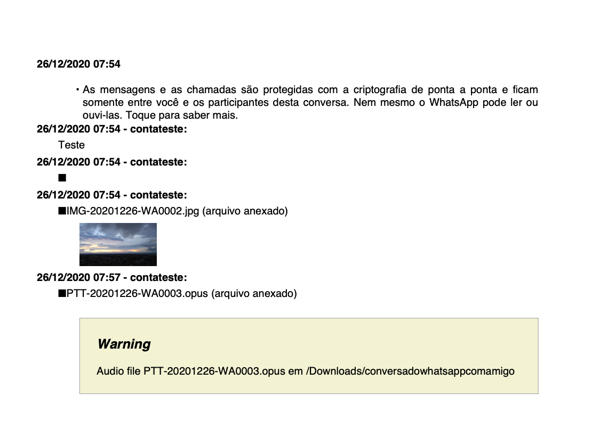
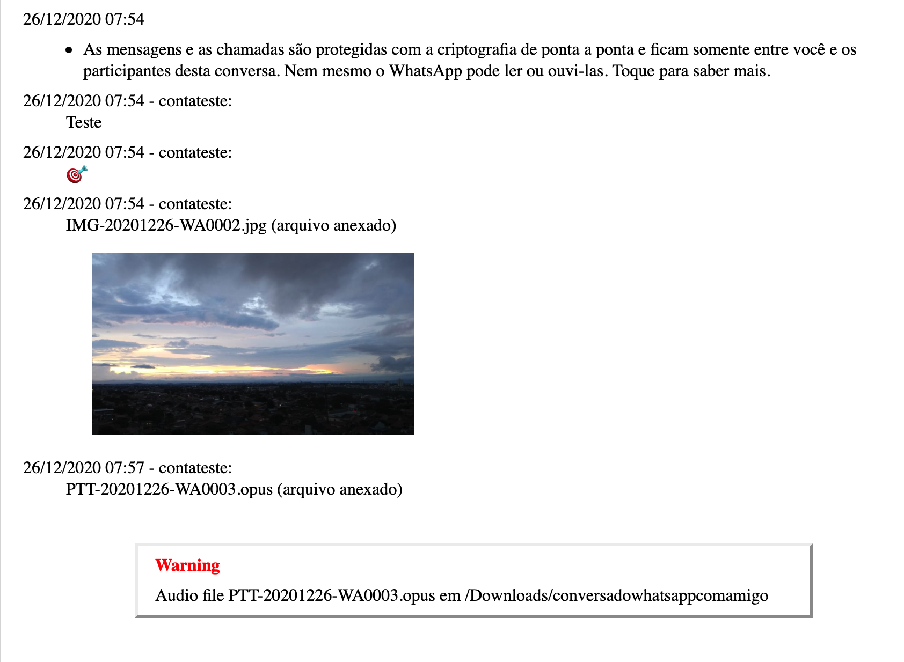
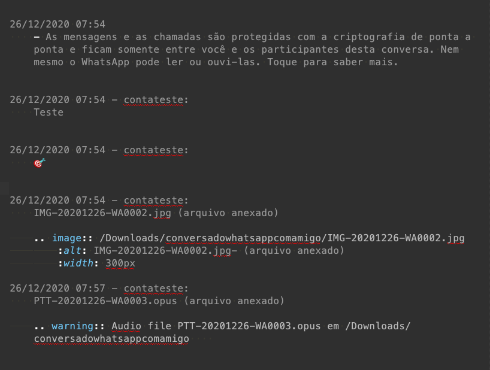
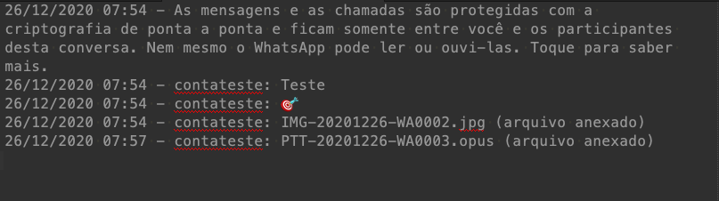

whatsapp 2 RestructuredText
===========================

Export whatsapp conversation files and media to RestructuredText

then using `pandoc`, `rst2pdf`, `rst2html5`, `sphinx`  you may have PDF or HTML version of a Whatsapp conversation.

Use 
===

- Export conversation from whatsapp
- Copy the files to a directory on your computer
- You may not have other ".txt" on same directory, the one found there will understood as the conversation file.
- Pictures will be linked using RestructuredText `img` directive
- Audio files will be just linked for now. 

positional arguments:
  input                 whatsapp text file name (a `.txt` file) - remember to use quotes (") for filename with spaces

optional arguments:
  -h, --help            show this help message and exit
  -m MEDIAPATH, --mediapath MEDIAPATH
                        path for media files
  -o OUTPUT, --output OUTPUT
                        output file name - generated ResructuredText

sample
------

simple call

.. code-block:: bash

    $> python3 -m zap2rst 'my conversation file with friend.txt'

If media files are at other path use `-m` asrgs to inform the path

.. code-block:: bash

    $> python3 -m zap2rst -m /mediapath/medias 'my conversation file with friend.txt'

    >>> Output generated: output.rst

you may specify an output file name 

.. code-block:: bash

    $> python3 -m zap2rst -o myconversation.rst 'my conversation file with friend.txt'

    >>> Output generated: output.rst

+----------------------------------+------------------------------------------+------------------------------+-----------------------------+
|      . . . .                     |               . . . . .                  | rst2pdf output.rst           | rst2html5 output.rst        |
+----------------------------------+------------------------------------------+------------------------------+-----------------------------+
| Whatsapp Exported file           | Output RestructuredText File             | PDF file                     | HTML File                   |
+==================================+==========================================+==============================+=============================+
| |whatsapp_conversation_original| | |whatsapp_conversation_restructuredtext| | |whatsapp_conversation_html| | |whatsapp_conversation_pdf| |
+----------------------------------+------------------------------------------+------------------------------+-----------------------------+

.. 
    cometário: alias to images 

